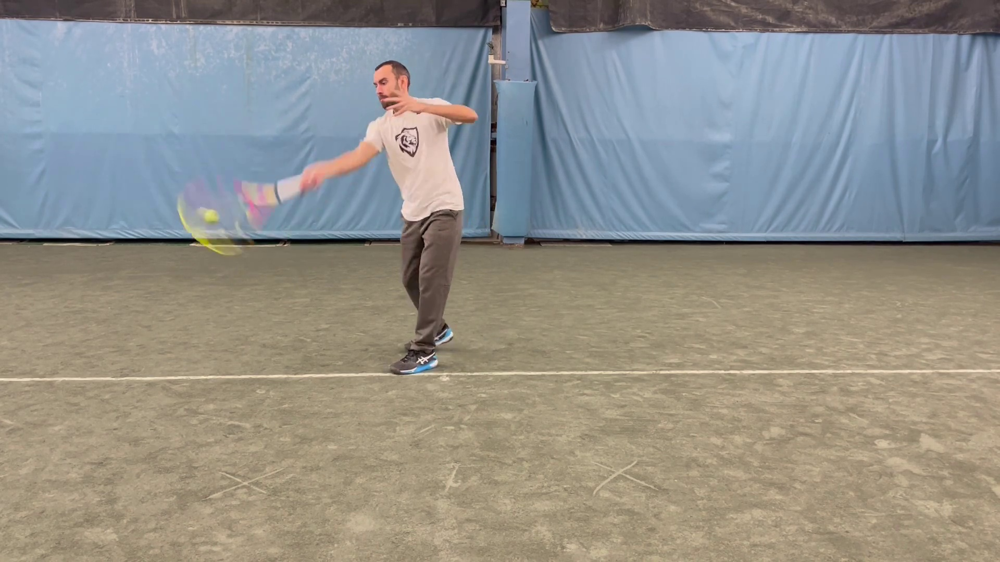
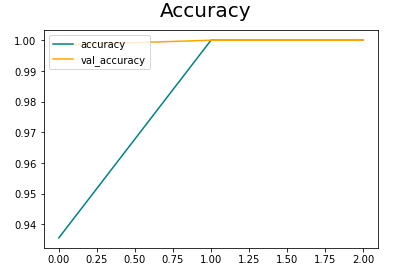
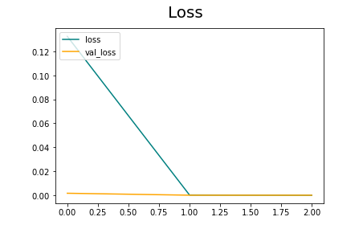
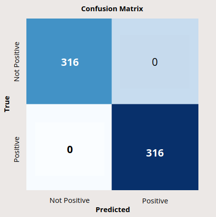

# Business Understanding

To help companies with computer vision for their A.I. tennis ball machines.

# Data Understanding

I created the dataset used for this project. It consisted of a balanced class of approximately 6,000 images of myself hitting forehand and backhand tennis shots. The data used for this project enabled me to build a convolutional neural network model for image classification. This model will aid in the ball machine being able to detect whether a player is hitting a forehand or backhand for training purposes. The limitations of this dataset was that it was fairly small and only consisted of images of myself from a couple different camera angles.

Dataset:[ForehandsandBackhands](https://www.kaggle.com/datasets/adammarianacci/forehands-and-backhands)




# Data Preparation

- I started by filming myself in a few different locations hitting approximately 200 forehands and 200 backhands. I then used an open source editing program called "Shotcut" to edit all of my swings from the start of my swing up until the point of contact with the tennis ball.

- I then converted these edited videos into mp4 format so that they could be extracted into frames.
    - I extracted the frames into folders and labeled the frames as either belonging to one of two classes, "1" for forehand and "0" for backhand. 
    - One video shot clip yielded roughly 15 frames.

- I constructed an iterator into my pipeline to be able to call on specific "batches" of data. 
    - I then scaled my data for optimization in the pipeline to make sure that all the images used were the same size.

- Finally I set up a train, test, split which was 80% for training, 10% for validation, and 10% for testing. I then set up a way to save and load my data after it has been trained into my pipeline so that more data could be input in the future.

# Modeling

- Convolutional Neural Network (CNN) designed for binary classification set to 20 epochs.

- Convolutional Neural Network set to 3 epochs. (See Evaluation section for full analysis)

# Evaluation

My best performing model was the CNN with an 'Adam' optomizer and loss function set to 'Binary Cross-Entropy' trained over 3 epochs. I adjusted the model from 20 epochs to 3 because the model was quickly acheiving a 100% accuracy score so this approximately saved about 1 hour of training time. The model was showing 100% accuracy scores on training and testing data. The model is most likely overfitting due to the low variance in my data making it over confident.





# Conclusion

The model is performing as well as it can on training and testing data. However we should be suspicious of these 100% accuracy scores because of the extremly low variance of the data used. In order for this model to be used in the real world it needs to be given a significant amount of data with a lot more variance. Some examples of the variance it needs are images of different people of all ages in different background settings.




## Limitations

The limitations of this dataset was that it was a fairly small dataset for modeling purposes. I only used images of myself hitting forehands and backhands in a few different locations from a couple different camera angles. This most likely led to the model being overconfident. To build a more robust model I will have to add a lot more variance to the data. Additionally the data only consisted of two handed backhand shots and not one-handed backhand shots.

## Recommendations

- Increase the amount of variance in the dataset.
- Use images from the start of swing preparation until the completion of the swing.

## Next Steps

Adding more variance to the dataset. 
- Gathering images of different people hitting forehands and backhands from different camera angles in different backgrounds.
- Gathering images of one-handed backhands.


## For More Information


See the full analysis in the [Jupyter Notebook](https://github.com/adammarianacci/Tennis_Shot_Analysis/blob/master/notebook.ipynb) or review this [presentation](https://github.com/adammarianacci/Tennis_Shot_Analysis/blob/master/presentation.pdf).

For additional info, contact Adam Marianacci (mailto:adam.marianacci@gmail.com)


## Repository Structure

```
├── data
├── images
├── README.md
├── presentation.pdf
└── notebook.ipynb
```